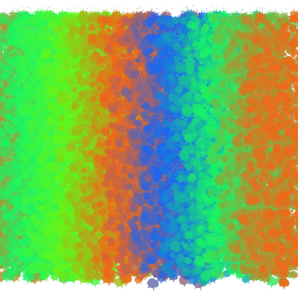

Data Drawing
============

Use data collected over the past week to make a drawing.

1. Create a processing sketch that loads in your data and creates an illustration using your data points
2. Import PDF from your sketch into Illustrator
3. Create a drawing / illustration using the imported sketch

You **must** procedurally generate part of your drawing from the data in processing, even if it seems like it might be easier to just do by hand.

Examples
--------

* [Quantitative example](example_quantitative/) - using numerical data to create a line from data points
* [Qualitative example](example_qualitative/) - using subjective data to draw a gradient